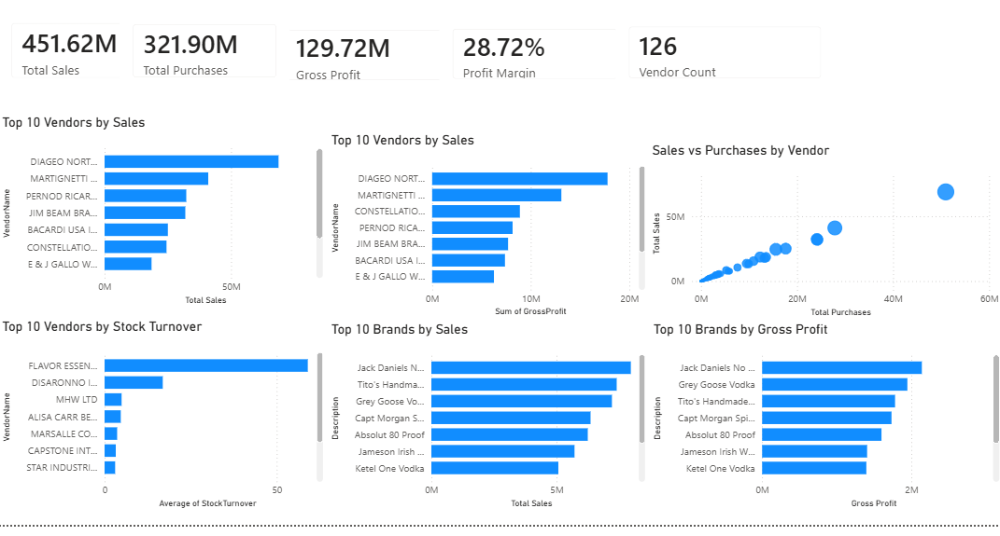
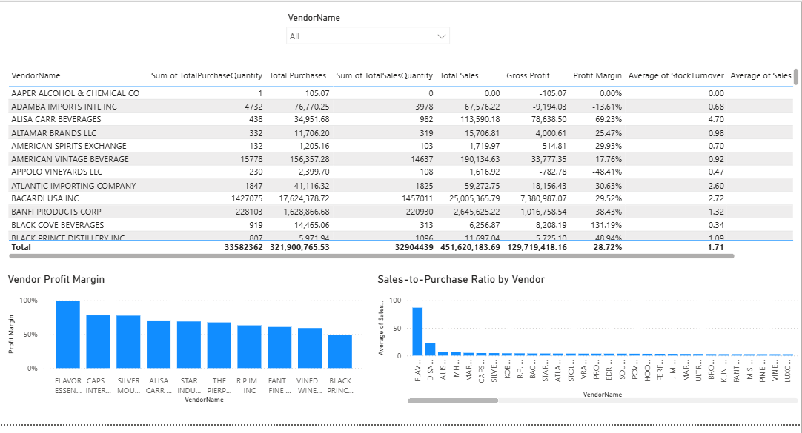
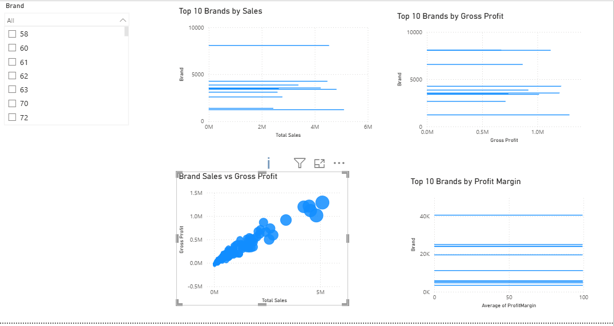
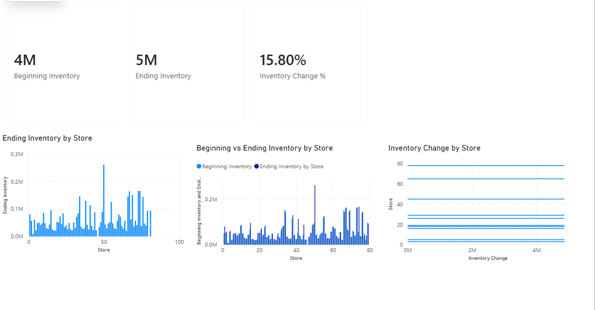

# Vendor Performance Analytics

##  Project Overview
Vendor Performance Analytics is an end-to-end data analytics project designed to evaluate vendor performance, sales, purchasing activity, profitability, and inventory efficiency.

The project uses Python, SQL, and Power BI to transform raw business data into meaningful analytics and interactive dashboards.

## Objectives

\- Analyze vendor sales and purchasing performance

\- Identify high-performing and low-performing vendors

\- Calculate gross profit and profit margins

\- Analyze inventory movement

\- Evaluate stock turnover

\- Compare vendor sales and purchases

\- Identify high-performing brands

\- Generate actionable business insights


## Technologies Used

\- Python

\- Pandas

\- NumPy

\- Matplotlib

\- SciPy

\- SQLite

\- SQL

\- Power BI

\- Git \& GitHub

## Project Structure

```text
Vendor-Performance-Analytics/
│
├── python/
├── sql/
├── powerbi/
├── screenshots/
├── reports/
├── .gitignore
└── README.md


```markdown
## Power BI Dashboard

The Power BI dashboard contains four pages.

### Dashboard Preview

#### 1. Executive Overview



#### 2. Vendor Performance



#### 3. Brand Performance



#### 4. Inventory Analysis



The Power BI dashboard contains four pages:

### 1. Executive Overview 

* Total Sales
* Total Purchases
* Gross Profit
* Profit Margin
* Vendor Count
* Top Vendors
* Sales vs Purchases

### 2. Vendor Performance

* Vendor filtering
* Vendor sales
* Vendor purchases
* Gross profit
* Profit margin
* Stock turnover
* Sales-to-purchase ratio

### 3. Brand Performance

* Brand filtering
* Top brands by sales
* Top brands by gross profit
* Brand sales vs gross profit
* Brand profit margin

### 4. Inventory Analysis

* Beginning inventory
* Ending inventory
* Inventory change
* Inventory by store
* Beginning vs ending inventory

## Statistical Analysis
The project includes:
* Descriptive statistics
* 25th and 75th percentile analysis
* Independent two-sample Welch's t-test
* Hypothesis testing
* 95% confidence intervals

## Key Business Metrics
The project calculates:
* Total Sales
* Total Purchases
* Gross Profit
* Profit Margin
* Stock Turnover
* Sales-to-Purchase Ratio
* Inventory Change
* Vendor Performance

## Business Insights
The analysis can be used to identify:
* High-performing vendors
* Low-performing vendors
* Profitable brands
* Vendors with inefficient inventory movement
* Potential inventory issues
* Differences between purchasing and sales performance

## Future Improvements
* Automated dashboard refresh
* Vendor performance prediction
* Sales forecasting
* Inventory demand forecasting
* Machine learning-based vendor risk scoring
* Automated business recommendations
